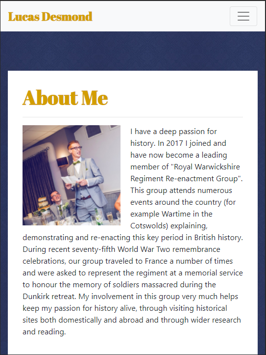
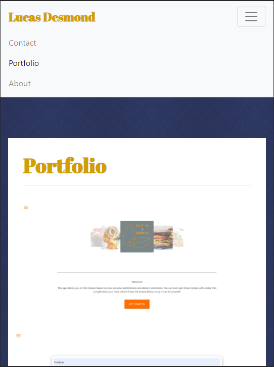
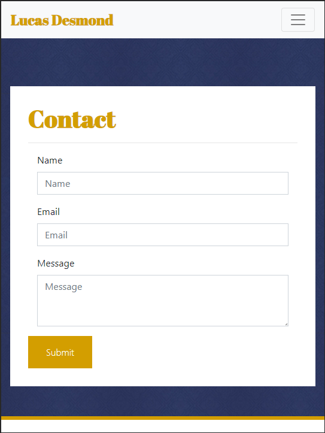

# Responsive Portfolio
### Description

I have built a concept design responsive portfolio, to display my work to possible employers.

---

### Table of Contents
* [Installation](#Installation) 
* [Usage](#Usage)  
* [Credits](#Credits)  
* [Badges](#Badges)  
* [License](#License)

---

### Installation 
<a href = "https://lukedesmond.github.io/Responsive-portfolio">Click me</a> to try out our app!

---

### Usage  
Here is my application in action!

 
 
 

---

### Links
Below is a link to my gitHub pages to see more of my work!

<a href = "https://github.com/lukedesmond/">Luke Desmond</a> 

 
---
  
### Credits
<b>CSS Frameworks Used</b> 

Bootstrap

<b>Developers</b> 
@LukeDesmond 

---

### Badges 
 
 

---

### License 
© 2020 Trilogy Education Services, a 2U, Inc. brand. All Rights Reserved.